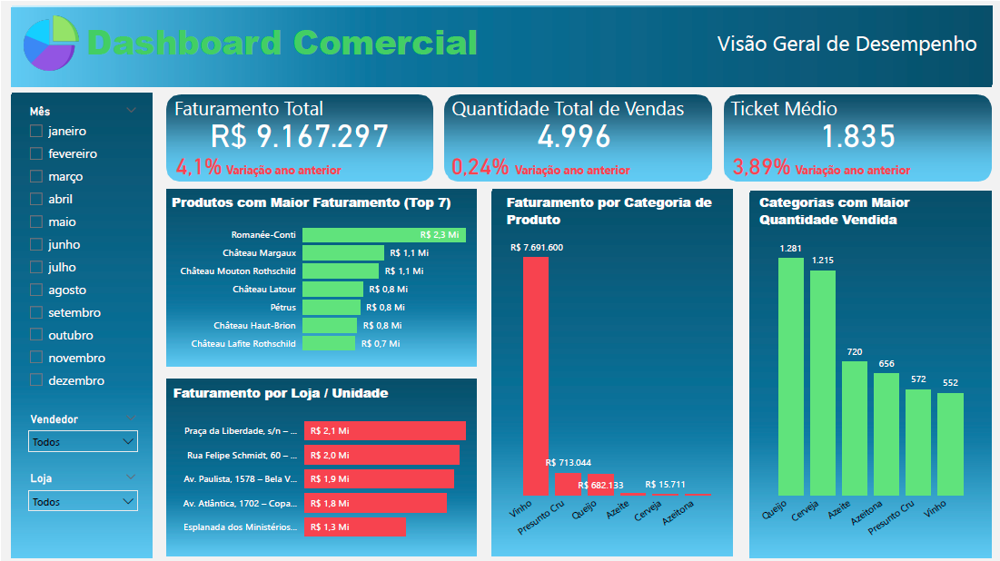
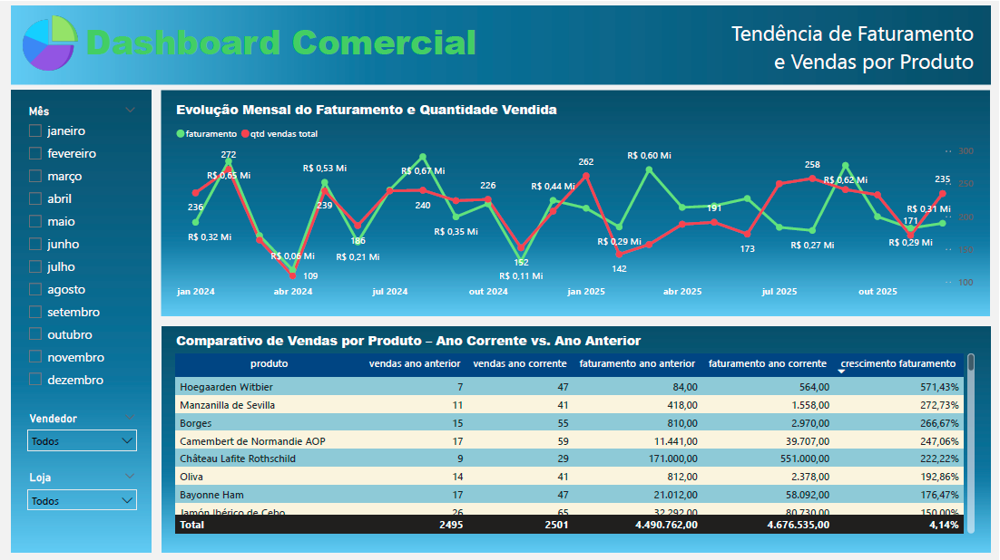
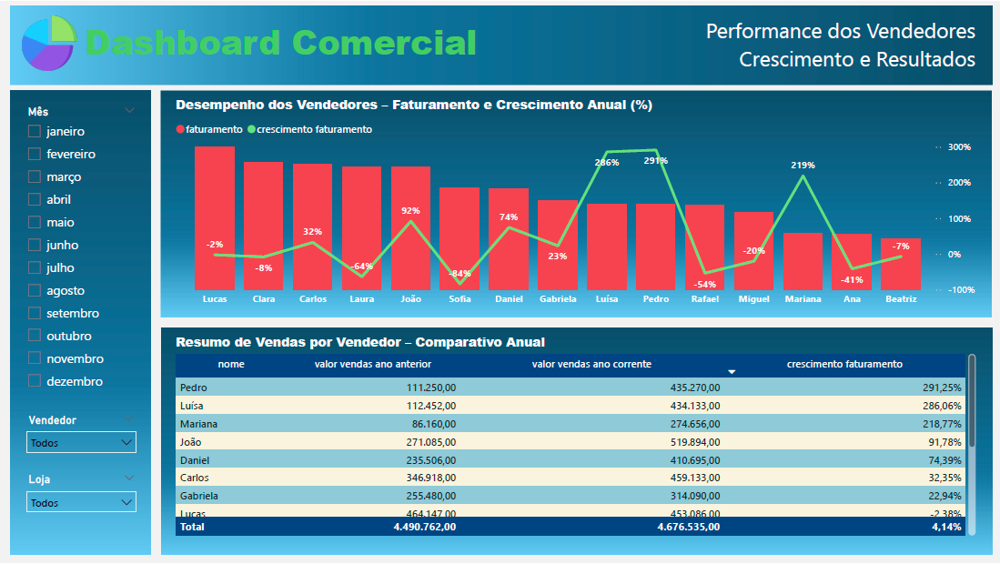

# Dashboard Comercial – Vendas e Tendência de Faturamento

Análise comercial com foco em faturamento, quantidade vendida, ticket médio, desempenho por produto e por loja. Modelagem e tratamento no Power BI (DAX e Power Query).

**Stack**: Power BI, DAX, Power Query (M)  

## KPIs
- Faturamento Total e variação vs. ano anterior
- Quantidade Total de Vendas
- Ticket Médio
- Top Produtos por Faturamento e Quantidade
- Faturamento por Loja/Unidade

## Principais insights
- Sazonalidade clara com picos em mar/out e quedas em abr/nov.
- Categorias e produtos premium concentram grande parte do faturamento.
- Lojas específicas respondem por parcela relevante da receita, sugerindo ações locais.

## Artefatos
- Arquivo Power BI: `dashboard/dashboard_comercial.pbix`
- Imagens: 
  - 
  - 
  - 

## Medidas DAX (exemplos)
```DAX
Faturamento Total = SUM ( fVendas[valor_venda] )

Quantidade Total = SUM ( fVendas[qtd] )

Ticket Médio = DIVIDE ( [Faturamento Total], [Quantidade Total] )

Faturamento LY = CALCULATE ( [Faturamento Total], SAMEPERIODLASTYEAR ( dCalendario[data] ) )

Variação % Ano = DIVIDE ( [Faturamento Total] - [Faturamento LY], [Faturamento LY] )
```

