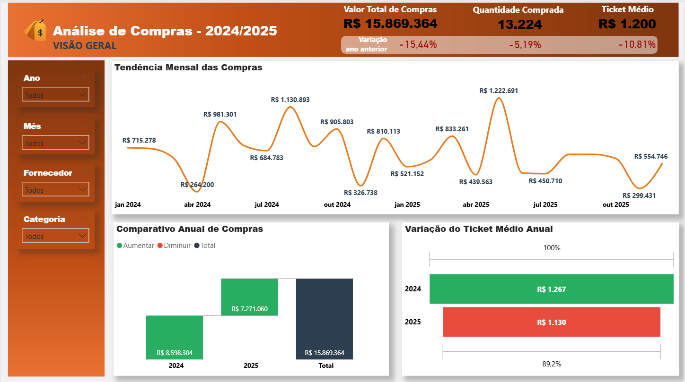
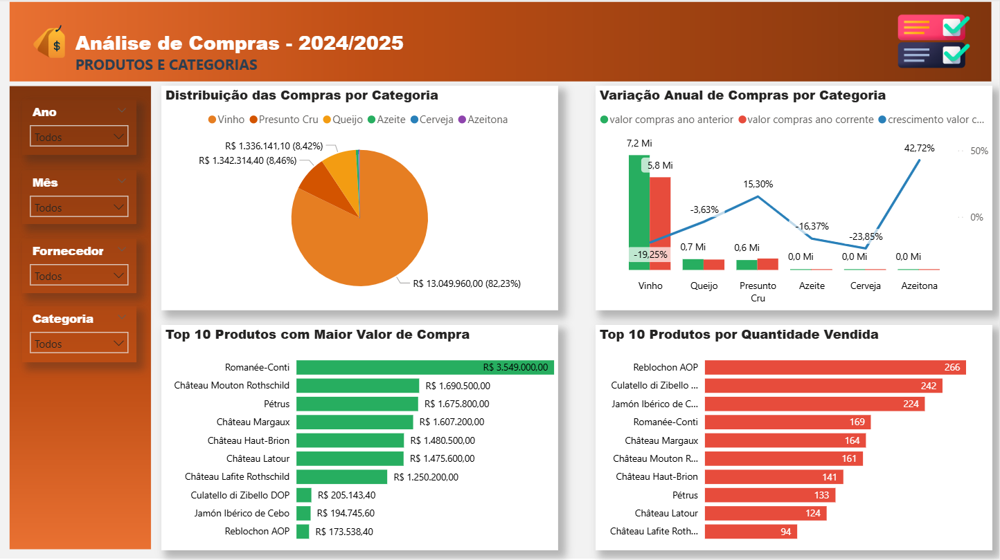
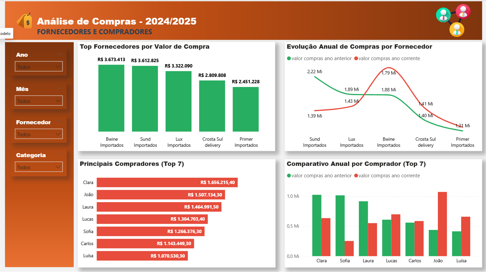

# Análise de Compras – Visão Geral, Produtos/Categorias e Fornecedores

Visão executiva das compras: valor total, quantidade, ticket médio, tendência mensal, variação anual, categorias, top produtos, fornecedores e principais compradores. Tratamento e modelagem feitos no Power BI.

**Stack**: Power BI, DAX, Power Query (M)  

## KPIs
- Valor Total de Compras e variação vs. ano anterior
- Quantidade Comprada
- Ticket Médio
- Top Fornecedores por Valor
- Top Produtos por Valor e por Quantidade

## Principais insights
- Queda anual no valor total com recuperação em meses específicos.
- Categoria dominante representa >70% do total – risco de concentração.
- Fornecedores top concentram grande parte do gasto – oportunidade de renegociação.

## Artefatos
- Arquivo Power BI: `dashboard/dashboard_compras.pbix`
- Imagens: 
  - 
  - 
  - 
  - 

## Medidas DAX (exemplos)
```DAX
Valor Compras = SUM ( fCompras[valor_compra] )

Qtd Comprada = SUM ( fCompras[qtd] )

Ticket Médio = DIVIDE ( [Valor Compras], [Qtd Comprada] )

Valor Compras LY = CALCULATE ( [Valor Compras], SAMEPERIODLASTYEAR ( dCalendario[data] ) )

Variação % Valor = DIVIDE ( [Valor Compras] - [Valor Compras LY], [Valor Compras LY] )
```

