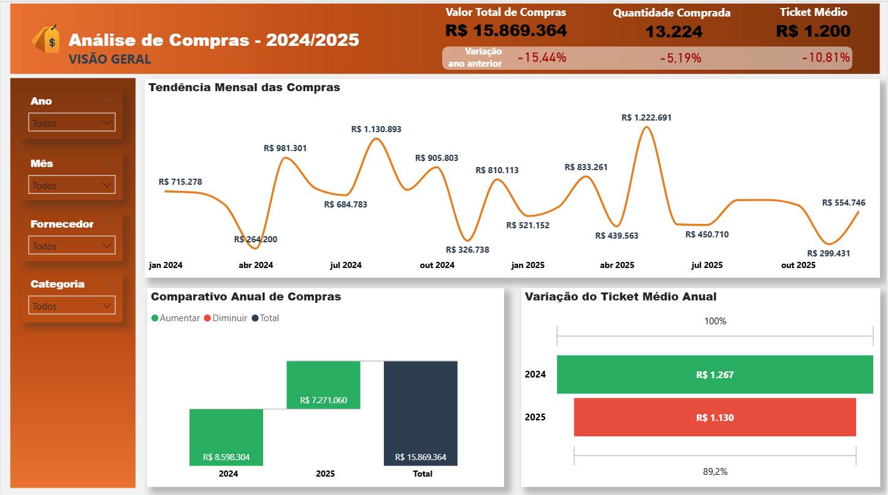
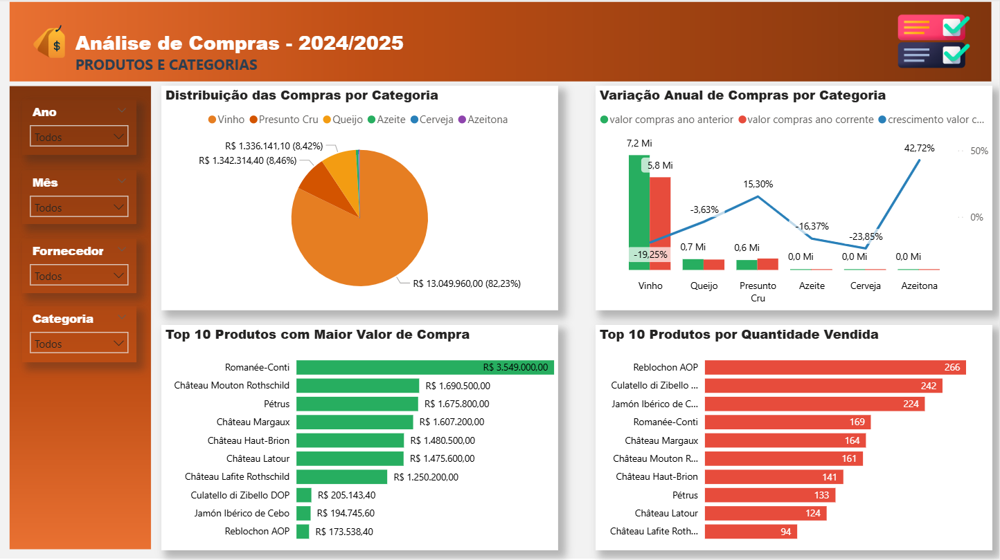
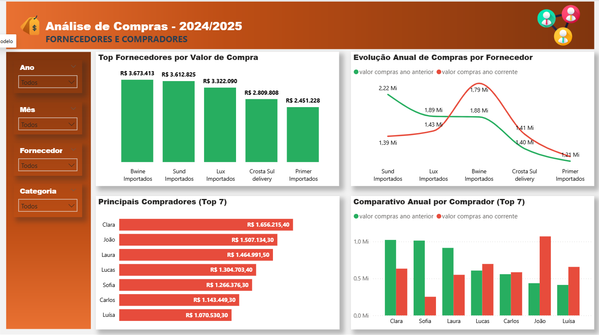

# Análise de Compras – Visão Geral, Produtos/Categorias e Fornecedores

Visão executiva das compras: valor total, quantidade, ticket médio, tendência mensal, variação anual, categorias, top produtos, fornecedores e principais compradores. Tratamento e modelagem feitos no Power BI.

**Stack**: Power BI, DAX, Power Query (M)  

## KPIs
- Valor Total de Compras e variação vs. ano anterior
- Quantidade Comprada
- Ticket Médio
- Top Fornecedores por Valor
- Top Produtos por Valor e por Quantidade

## Principais insights
- Queda anual no valor total com recuperação em meses específicos.
- Categoria dominante representa >70% do total – risco de concentração.
- Fornecedores top concentram grande parte do gasto – oportunidade de renegociação.

## Artefatos
- Arquivo Power BI: `dashboard/dashboard_compras.pbix`
- Imagens: 
  - 
  - 
  - 
  - 

## Medidas DAX (exemplos)
```DAX
Valor Compras = SUM ( fCompras[valor_compra] )

Qtd Comprada = SUM ( fCompras[qtd] )

Ticket Médio = DIVIDE ( [Valor Compras], [Qtd Comprada] )

Valor Compras LY = CALCULATE ( [Valor Compras], SAMEPERIODLASTYEAR ( dCalendario[data] ) )

Variação % Valor = DIVIDE ( [Valor Compras] - [Valor Compras LY], [Valor Compras LY] )
```

## Power Query – Etapas base (M)
```M
let
    Fonte = Excel.Workbook(File.Contents("data_source.xlsx"), null, true),
    Tabela = Fonte{[Item="Tabela1",Kind="Table"]}[Data],
    #"Tipos Definidos" = Table.TransformColumnTypes(Tabela,{{"data", type date},{"valor", type number}}),
    #"Colunas Renomeadas" = Table.RenameColumns(#"Tipos Definidos",{{"valor","valor_bruto"}}),
    #"Valores Substituídos" = Table.ReplaceValue(#"Colunas Renomeadas",null,0,Replacer.ReplaceValue,{"valor_bruto"}),
    #"Coluna Ano" = Table.AddColumn(#"Valores Substituídos", "ano", each Date.Year([data]), Int64.Type),
    #"Coluna Mes" = Table.AddColumn(#"Colunas Renomeadas", "mes", each Date.Month([data]), Int64.Type)
in
    #"Coluna Mes"

```

## English summary
**Purpose**: Visão executiva das compras: valor total, quantidade, ticket médio, tendência mensal, variação anual, categorias, top produtos, fornecedores e principais compradores. Tratamento e modelagem feitos no Power BI.  
**Stack**: Power BI, DAX, Power Query (M).  
**Key KPIs**: Valor Total de Compras e variação vs. ano anterior; Quantidade Comprada; Ticket Médio; Top Fornecedores por Valor; Top Produtos por Valor e por Quantidade.
