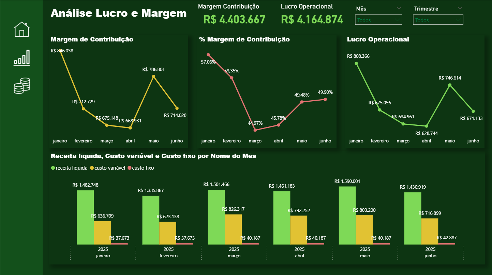
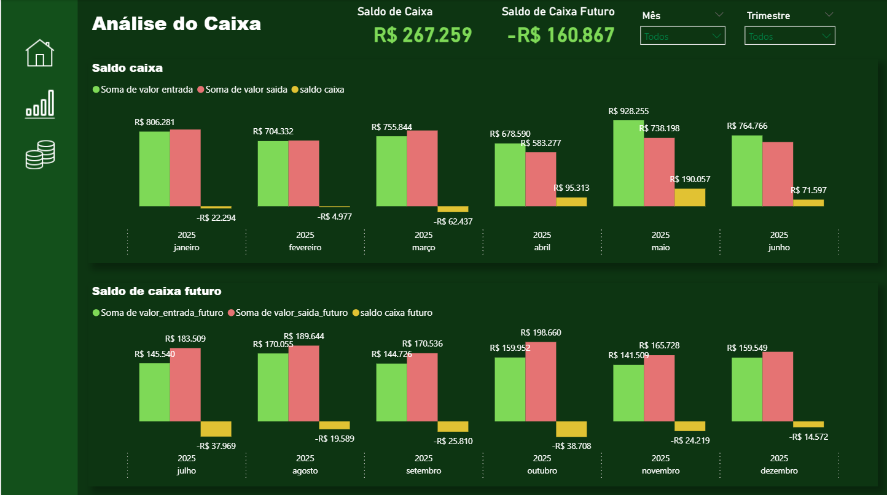

# Financeiro – Margem de Contribuição, Lucro Operacional e Caixa

Conjunto de páginas para gestão financeira: margem de contribuição, % margem, lucro operacional, saldo de caixa atual e futuro. Trabalho de transformação e medidas DAX no Power BI.

**Stack**: Power BI, DAX, Power Query (M)  

## KPIs
- Margem de Contribuição (R$ e %)
- Lucro Operacional
- Receita Líquida, Custo Variável e Custo Fixo
- Saldo de Caixa e Saldo de Caixa Futuro

## Principais insights
- Oscilação de margem ao longo dos meses indica impacto de custos variáveis.
- Meses com saldo de caixa negativo no futuro demandam ajustes de entrada/saída.
- Receita apresenta recuperação em maio/junho – oportunidade de consolidar ganhos.

## Artefatos
- Arquivo Power BI: `dashboard/dashboard_financeiro.pbix`
- Imagens: 
  - 
  - 
  - 

## Medidas DAX (exemplos)
```DAX
Receita Líquida = SUM ( fFinanceiro[receita_liquida] )

Custo Variável = SUM ( fFinanceiro[custo_variavel] )

Custo Fixo = SUM ( fFinanceiro[custo_fixo] )

Margem Contribuição = [Receita Líquida] - [Custo Variável]

% Margem Contribuição = DIVIDE ( [Margem Contribuição], [Receita Líquida] )

Lucro Operacional = [Margem Contribuição] - [Custo Fixo]
```

