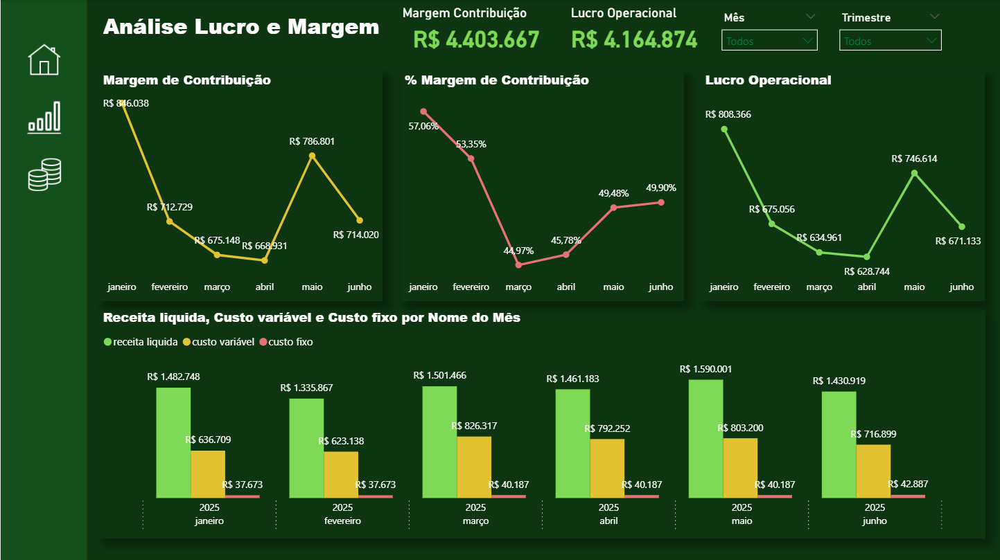
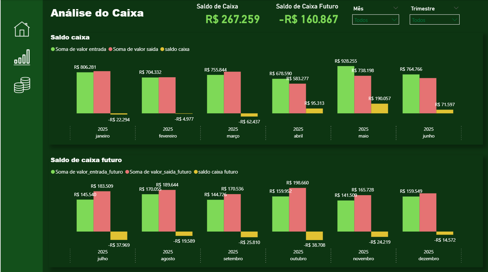

# Financeiro – Margem de Contribuição, Lucro Operacional e Caixa

Conjunto de páginas para gestão financeira: margem de contribuição, % margem, lucro operacional, saldo de caixa atual e futuro. Trabalho de transformação e medidas DAX no Power BI.

**Stack**: Power BI, DAX, Power Query (M)  

## KPIs
- Margem de Contribuição (R$ e %)
- Lucro Operacional
- Receita Líquida, Custo Variável e Custo Fixo
- Saldo de Caixa e Saldo de Caixa Futuro

## Principais insights
- Oscilação de margem ao longo dos meses indica impacto de custos variáveis.
- Meses com saldo de caixa negativo no futuro demandam ajustes de entrada/saída.
- Receita apresenta recuperação em maio/junho – oportunidade de consolidar ganhos.

## Artefatos
- Arquivo Power BI: `dashboard/dashboard_financeiro.pbix`
- Imagens: 
  - 
  - 
  - 

## Medidas DAX (exemplos)
```DAX
Receita Líquida = SUM ( fFinanceiro[receita_liquida] )

Custo Variável = SUM ( fFinanceiro[custo_variavel] )

Custo Fixo = SUM ( fFinanceiro[custo_fixo] )

Margem Contribuição = [Receita Líquida] - [Custo Variável]

% Margem Contribuição = DIVIDE ( [Margem Contribuição], [Receita Líquida] )

Lucro Operacional = [Margem Contribuição] - [Custo Fixo]
```

## Power Query – Etapas base (M)
```M
let
    Fonte = Excel.Workbook(File.Contents("data_source.xlsx"), null, true),
    Tabela = Fonte{[Item="Tabela1",Kind="Table"]}[Data],
    #"Tipos Definidos" = Table.TransformColumnTypes(Tabela,{{"data", type date},{"valor", type number}}),
    #"Colunas Renomeadas" = Table.RenameColumns(#"Tipos Definidos",{{"valor","valor_bruto"}}),
    #"Valores Substituídos" = Table.ReplaceValue(#"Colunas Renomeadas",null,0,Replacer.ReplaceValue,{"valor_bruto"}),
    #"Coluna Ano" = Table.AddColumn(#"Valores Substituídos", "ano", each Date.Year([data]), Int64.Type),
    #"Coluna Mes" = Table.AddColumn(#"Colunas Renomeadas", "mes", each Date.Month([data]), Int64.Type)
in
    #"Coluna Mes"

```

## English summary
**Purpose**: Conjunto de páginas para gestão financeira: margem de contribuição, % margem, lucro operacional, saldo de caixa atual e futuro. Trabalho de transformação e medidas DAX no Power BI.  
**Stack**: Power BI, DAX, Power Query (M).  
**Key KPIs**: Margem de Contribuição (R$ e %); Lucro Operacional; Receita Líquida, Custo Variável e Custo Fixo; Saldo de Caixa e Saldo de Caixa Futuro.
