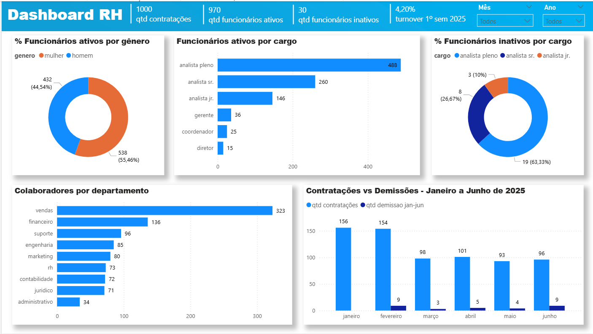

# Dashboard RH – Headcount, Turnover e Movimentações

Painel de RH com headcount, contratações, demissões, distribuição por gênero, cargos e departamentos, além de série temporal de admissões e desligamentos. Modelagem no Power BI.

**Stack**: Power BI, DAX, Power Query (M)  

## KPIs
- Headcount Ativo e Inativo
- Contratações e Demissões (período)
- Turnover
- Distribuição por Gênero, Cargo e Departamento

## Principais insights
- Maior concentração em cargos de analistas e no departamento de vendas.
- Turnover controlado no semestre, com atenção a picos mensais.
- Distribuição por gênero equilibrada, com leve predominância masculina.

## Artefatos
- Arquivo Power BI: `dashboard/dashboard_rh.pbix`
- Imagens: 
  - 

## Medidas DAX (exemplos)
```DAX
Headcount Ativo = CALCULATE ( DISTINCTCOUNT ( fRH[id_func] ), fRH[status] = "ativo" )

Headcount Inativo = CALCULATE ( DISTINCTCOUNT ( fRH[id_func] ), fRH[status] = "inativo" )

Contratações = COUNTROWS ( FILTER ( fEventos, fEventos[tipo] = "admissao" ) )

Demissões = COUNTROWS ( FILTER ( fEventos, fEventos[tipo] = "demissao" ) )

Turnover % = DIVIDE ( [Demissões], [Headcount Ativo] + [Headcount Inativo] )
```