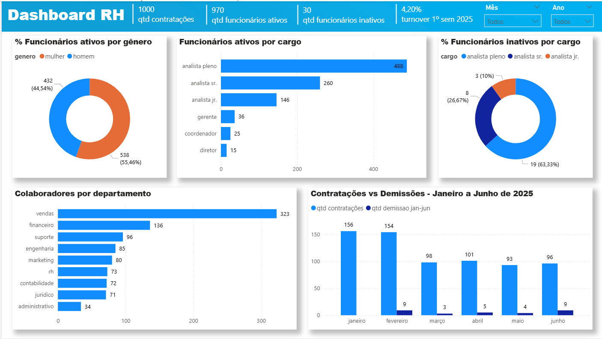

# Dashboard RH – Headcount, Turnover e Movimentações

Painel de RH com headcount, contratações, demissões, distribuição por gênero, cargos e departamentos, além de série temporal de admissões e desligamentos. Modelagem no Power BI.

**Stack**: Power BI, DAX, Power Query (M)  

## KPIs
- Headcount Ativo e Inativo
- Contratações e Demissões (período)
- Turnover
- Distribuição por Gênero, Cargo e Departamento

## Principais insights
- Maior concentração em cargos de analistas e no departamento de vendas.
- Turnover controlado no semestre, com atenção a picos mensais.
- Distribuição por gênero equilibrada, com leve predominância masculina.

## Artefatos
- Arquivo Power BI: `dashboard/dashboard_rh.pbix`
- Imagens: 
  - 

## Medidas DAX (exemplos)
```DAX
Headcount Ativo = CALCULATE ( DISTINCTCOUNT ( fRH[id_func] ), fRH[status] = "ativo" )

Headcount Inativo = CALCULATE ( DISTINCTCOUNT ( fRH[id_func] ), fRH[status] = "inativo" )

Contratações = COUNTROWS ( FILTER ( fEventos, fEventos[tipo] = "admissao" ) )

Demissões = COUNTROWS ( FILTER ( fEventos, fEventos[tipo] = "demissao" ) )

Turnover % = DIVIDE ( [Demissões], [Headcount Ativo] + [Headcount Inativo] )
```

## Power Query – Etapas base (M)
```M
let
    Fonte = Excel.Workbook(File.Contents("data_source.xlsx"), null, true),
    Tabela = Fonte{[Item="Tabela1",Kind="Table"]}[Data],
    #"Tipos Definidos" = Table.TransformColumnTypes(Tabela,{{"data", type date},{"valor", type number}}),
    #"Colunas Renomeadas" = Table.RenameColumns(#"Tipos Definidos",{{"valor","valor_bruto"}}),
    #"Valores Substituídos" = Table.ReplaceValue(#"Colunas Renomeadas",null,0,Replacer.ReplaceValue,{"valor_bruto"}),
    #"Coluna Ano" = Table.AddColumn(#"Valores Substituídos", "ano", each Date.Year([data]), Int64.Type),
    #"Coluna Mes" = Table.AddColumn(#"Colunas Renomeadas", "mes", each Date.Month([data]), Int64.Type)
in
    #"Coluna Mes"

```

## English summary
**Purpose**: Painel de RH com headcount, contratações, demissões, distribuição por gênero, cargos e departamentos, além de série temporal de admissões e desligamentos. Modelagem no Power BI.  
**Stack**: Power BI, DAX, Power Query (M).  
**Key KPIs**: Headcount Ativo e Inativo; Contratações e Demissões (período); Turnover; Distribuição por Gênero, Cargo e Departamento.
