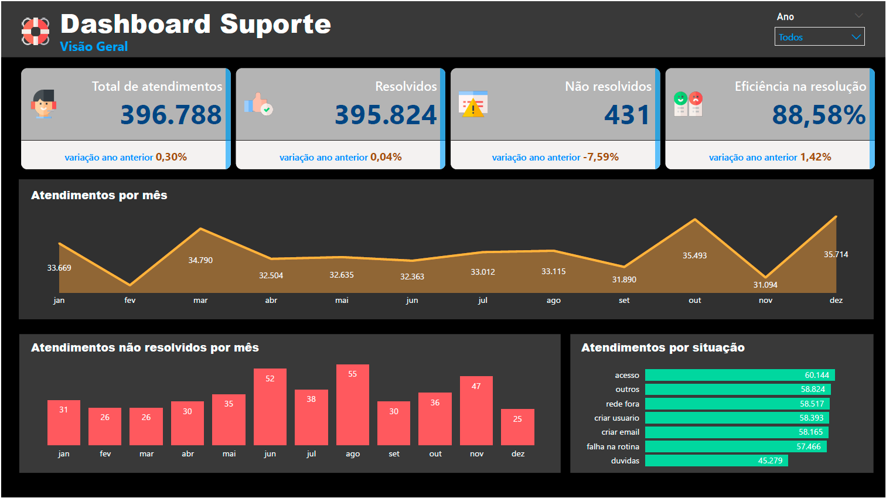
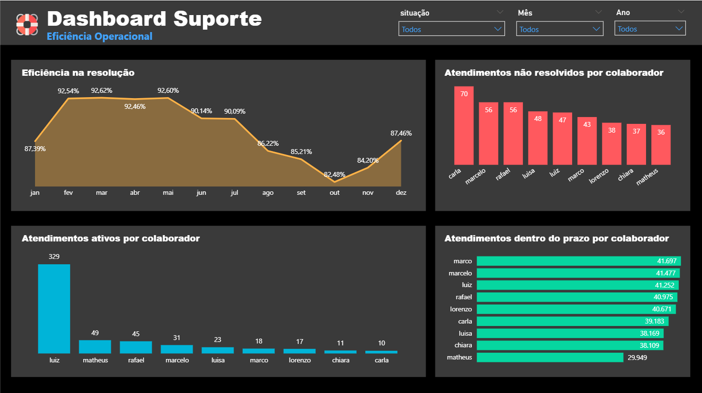
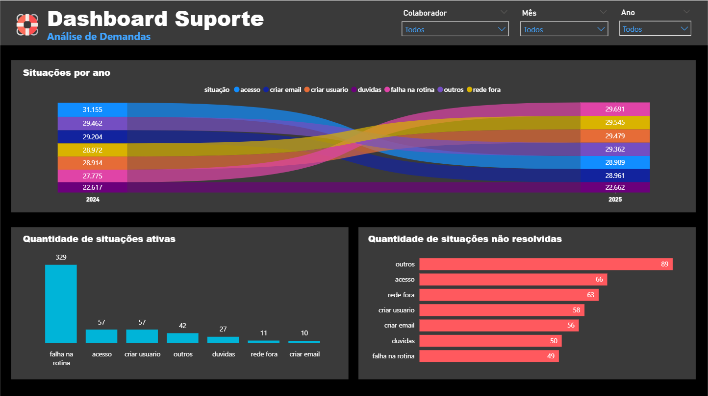
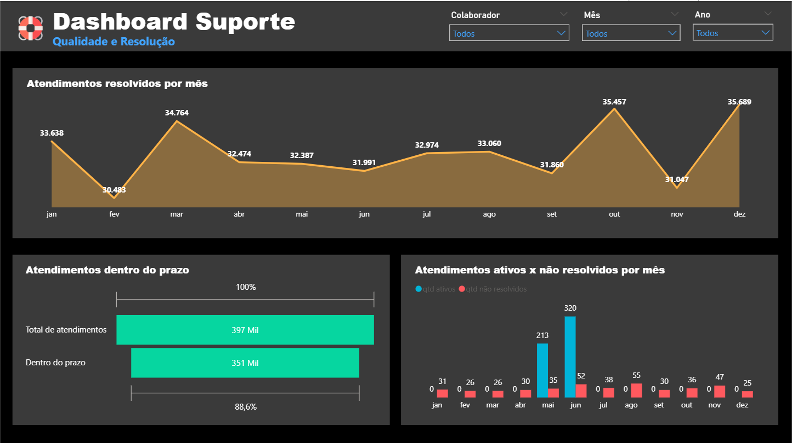

# Dashboard Suporte – Demandas, Qualidade e Eficiência Operacional

Conjunto de painéis operacionais de suporte: volume total de atendimentos, resolvidos e não resolvidos, eficiência na resolução, tempo/prazo e desempenho por colaborador.

**Stack**: Power BI, DAX, Power Query (M)  

## KPIs
- Total de Atendimentos e variação vs. ano anterior
- Eficiência na Resolução (%)
- Atendimentos Não Resolvidos (por mês e por colaborador)
- Atendimentos Dentro do Prazo
- Situações por Categoria

## Principais insights
- Picos de volume em mar/out exigem alocação de equipe.
- Eficiência acima de 88% com queda no 3º trimestre – monitorar causas.
- Colaboradores com alto volume ativo podem indicar gargalos.

## Artefatos
- Arquivo Power BI: `dashboard/dashboard_suporte.pbix`
- Imagens: 
  - 
  - 
  - 
  - 

## Medidas DAX (exemplos)
```DAX
Atendimentos Totais = SUM ( fSuporte[qtd] )

Atendimentos Resolvidos = SUM ( fSuporte[qtd_resolvidos] )

Eficiência Resolução % = DIVIDE ( [Atendimentos Resolvidos], [Atendimentos Totais] )

Nao Resolvidos = [Atendimentos Totais] - [Atendimentos Resolvidos]
```