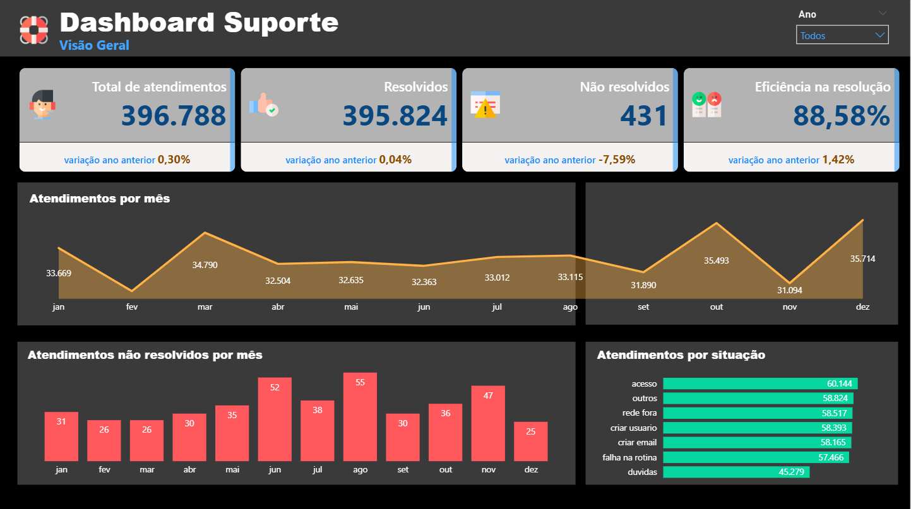
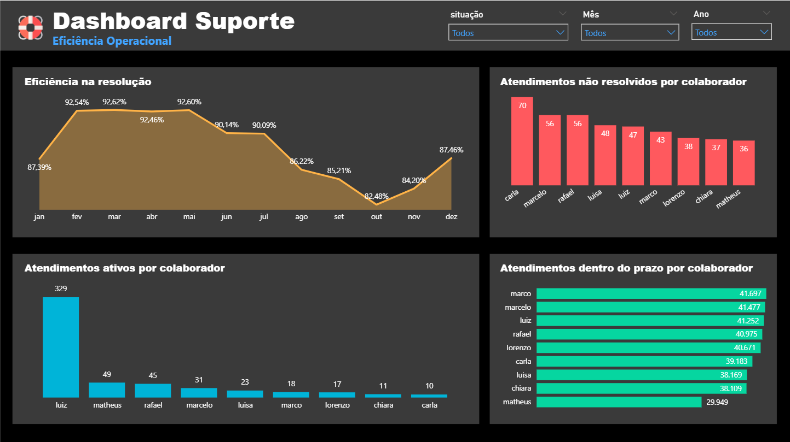
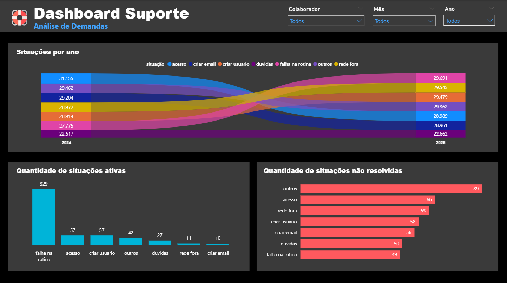
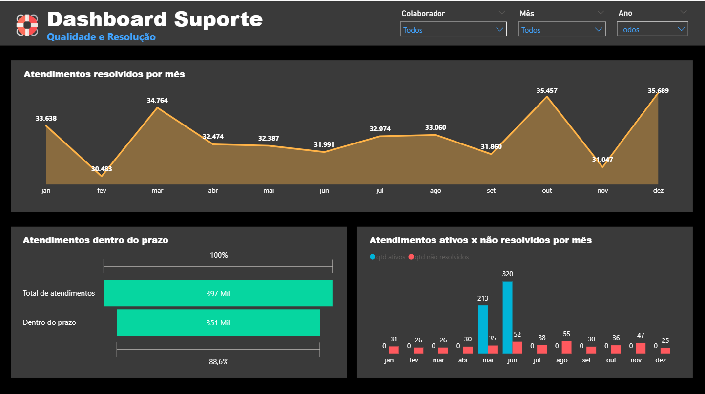

# Dashboard Suporte – Demandas, Qualidade e Eficiência Operacional

Conjunto de painéis operacionais de suporte: volume total de atendimentos, resolvidos e não resolvidos, eficiência na resolução, tempo/prazo e desempenho por colaborador.

**Stack**: Power BI, DAX, Power Query (M)  

## KPIs
- Total de Atendimentos e variação vs. ano anterior
- Eficiência na Resolução (%)
- Atendimentos Não Resolvidos (por mês e por colaborador)
- Atendimentos Dentro do Prazo
- Situações por Categoria

## Principais insights
- Picos de volume em mar/out exigem alocação de equipe.
- Eficiência acima de 88% com queda no 3º trimestre – monitorar causas.
- Colaboradores com alto volume ativo podem indicar gargalos.

## Artefatos
- Arquivo Power BI: `dashboard/dashboard_suporte.pbix`
- Imagens: 
  - 
  - 
  - 
  - 

## Medidas DAX (exemplos)
```DAX
Atendimentos Totais = SUM ( fSuporte[qtd] )

Atendimentos Resolvidos = SUM ( fSuporte[qtd_resolvidos] )

Eficiência Resolução % = DIVIDE ( [Atendimentos Resolvidos], [Atendimentos Totais] )

Nao Resolvidos = [Atendimentos Totais] - [Atendimentos Resolvidos]
```

## Power Query – Etapas base (M)
```M
let
    Fonte = Excel.Workbook(File.Contents("data_source.xlsx"), null, true),
    Tabela = Fonte{[Item="Tabela1",Kind="Table"]}[Data],
    #"Tipos Definidos" = Table.TransformColumnTypes(Tabela,{{"data", type date},{"valor", type number}}),
    #"Colunas Renomeadas" = Table.RenameColumns(#"Tipos Definidos",{{"valor","valor_bruto"}}),
    #"Valores Substituídos" = Table.ReplaceValue(#"Colunas Renomeadas",null,0,Replacer.ReplaceValue,{"valor_bruto"}),
    #"Coluna Ano" = Table.AddColumn(#"Valores Substituídos", "ano", each Date.Year([data]), Int64.Type),
    #"Coluna Mes" = Table.AddColumn(#"Colunas Renomeadas", "mes", each Date.Month([data]), Int64.Type)
in
    #"Coluna Mes"

```

## English summary
**Purpose**: Conjunto de painéis operacionais de suporte: volume total de atendimentos, resolvidos e não resolvidos, eficiência na resolução, tempo/prazo e desempenho por colaborador.  
**Stack**: Power BI, DAX, Power Query (M).  
**Key KPIs**: Total de Atendimentos e variação vs. ano anterior; Eficiência na Resolução (%); Atendimentos Não Resolvidos (por mês e por colaborador); Atendimentos Dentro do Prazo; Situações por Categoria.
